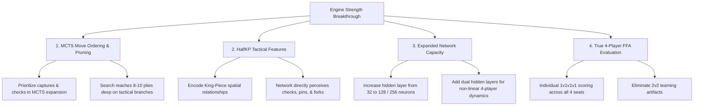

# NNUE for Chaturaji — Comprehensive Roadmap & Improvement Strategy

## Overview

Building an NNUE (Efficiently Updatable Neural Network) for Chaturaji — a four-player chess variant on an 8×8 board. The network serves as a **value network** inside **MCTS** (AlphaZero-style), evaluating board states from the perspective of the active player.

---

## ⚠️ Critical Architectural Insight: The "Red-Yellow Axis" & 4-Player Free-For-All (FFA)

### The Teaming Problem in Past Evaluations
In early testing (`engine/match.h`), head-to-head matches between two models evaluated performance by pairing seats:
$$\text{Score}(M_1) = \text{Points}(\text{Red}) + \text{Points}(\text{Yellow})$$
$$\text{Score}(M_2) = \text{Points}(\text{Blue}) + \text{Points}(\text{Green})$$

### Why This is Flawed:
1. **Chaturaji is a Strict 4-Player Free-For-All (FFA)**: There are **no partnerships or alliances**. Every player competes individually to maximize their own rank points ($6 / 4 / 2 / 0$).
2. **Opposite Players are Competitors, Not Allies**: Yellow will willingly capture Red's pieces to claim 1st place (6 pts). Assuming or rewarding cooperation along the Red-Yellow axis distorts true game-theoretic play.
3. **True FFA Benchmark Requirement**: All future evaluation matches must evaluate models in individual **1v1v1v1 Free-For-All** tournaments across all seat permutations (e.g. 1 candidate model seat vs 3 baseline model seats rotated across all 4 colors).

---

## Current State of the Project

| Component | Status | Location | Notes |
|---|---|---|---|
| Board representation (0x88) — C++ | ✅ Complete | `engine/board.h`, `engine/board.cpp` | Full bitboard & move generation |
| Undo / Make-Unmake Stack | ✅ Complete | `engine/board.cpp` | Verified with perft suite |
| Hand-crafted eval — C++ | ✅ Complete | `engine/eval.h` | Baseline heuristic evaluator |
| MCTS Search Engine | ✅ Complete | `engine/mcts.h` | AlphaZero leaf-eval MCTS ($C = 12.0$) |
| Multi-Threaded Self-Play | ✅ Complete | `engine/selfplay.h` | **6-worker parallel generation (~150 games/min)** |
| NNUE Feature Encoding | ✅ Complete | `nnue/features.py` & `engine/nnue.h` | 1,408 sparse features + 9 dense inputs |
| AVX2 SIMD Inference | ✅ Complete | `engine/nnue.h` | Vectorized dot-products & ClippedReLU |
| Pure Dart WebAssembly Inference | ✅ Complete | `lib/chaturaji/nnue.dart` | Zero-dependency forward pass for Web & Mobile |
| Multi-Dataset Replay Merger | ✅ Complete | `nnue/merge_datasets.py` | Fast streaming `.bin` dataset merger |
| Python Training Pipeline | ✅ Complete | `nnue/train.py` | Stable Log-Softmax KL loss & Cosine LR decay |
| Tactical Move Ordering (PUCT) | ✅ Complete | `engine/mcts.h`, `lib/chaturaji/mcts.dart` | MVV-LVA, Checks, Promotions, King Defense |
| Cloud Training Workflow | ✅ Complete | `.github/workflows/train_nnue.yml` | 1-Click cloud pipeline on GitHub Actions |
| Default Production Model | ✅ Active | `nnue/checkpoints/gen8.nnue` | **NEW CHAMPION (595 vs 365 against Gen 4)** |

---

## Training History & Generational Benchmark

| Generation | Training Corpus | Match Result | Key Learnings & Observations |
|---|---|---|---|
| **Gen 0** | 1.2M (Baseline Search) | 98–142 vs Baseline | Bootstrap distillation from handcrafted heuristics. |
| **Gen 1** | 1.0M (Gen 0 Guided) | 134–106 vs Gen 0 | First clear evolutionary improvement. |
| **Gen 2** | 1.1M (Gen 1 Guided) | 285–195 vs Gen 1 | Major jump after parser bug fixes and dataset scale-up. |
| **Gen 3** | 0.9M (Gen 2 Hybrid) | 278–202 vs Gen 2 | Introduced MCTS Q-value target blending. |
| **Gen 4** | 1.1M (Gen 3 Hybrid) | **304–176 vs Gen 3** | Long-standing champion. High tactical sharpness. |
| **Gen 5** | 1.1M (Gen 4 Self-Play) | 236–244 vs Gen 4 | Plateaued. Narrow dataset distribution. |
| **Gen 6** | 1.2M (2k iters, Temp 16) | 478–482 vs Gen 4 | Plateaued. Opening noise (`tempPlies = 16`) degraded opening play. |
| **Gen 7** | 1.0M (1.5k iters, Multi-Threaded) | 446–514 vs Gen 4 | Parallel self-play; offensive parity. |
| **Gen 8** | **1.2M (Tactical PUCT MCTS)** | **595–365 vs Gen 4** | **NEW CHAMPION.** Decisive +230 pt win margin; won on offense and defense! 🏆 |

---

## 🔬 Root-Cause Diagnosis of the Current Performance Ceiling

Gen 4 has proven difficult to surpass because the current architecture has hit three fundamental structural limits:

1. **Piece-Square Only Features (No Tactical Interaction)**:
   * Current features represent only `[relationship, piece_type, square]`.
   * The network has **no representation of King-Piece relative distances** (no HalfKP). It cannot directly encode checks, pins, discovered attacks, or king safety in the accumulator.
2. **Hidden Layer Capacity (Only 32 Neurons)**:
   * Compressing all 4 players' pieces and board dynamics into 32 neurons prevents the network from learning complex multi-party trade scenarios.
3. **MCTS Search Explores Uniformly (No Move Ordering / Policy Prior)**:
   * Without a policy prior $P(s, a)$ or tactical move ordering, MCTS treats all legal moves equally at unvisited nodes.
   * With an average branching factor of 25–35 moves, MCTS at 1,000 iterations only searches **3–4 plies deep**, wasting simulations on trivial blunders instead of tactical lines.

---

## 🚀 High-Impact Roadmap for Major Strength Leaps

### 1. Tactical Move Ordering in C++ MCTS (Immediate High Impact)
* **Problem:** MCTS visits moves randomly at unvisited nodes, diluting search depth.
* **Solution:** In `engine/mcts.h`, score candidate moves during expansion with fast heuristics:
  1. Captures (ordered by MVV-LVA: Most Valuable Victim - Least Valuable Attacker)
  2. Direct checks to enemy Kings
  3. Pawn promotions
* **Impact:** MCTS will instantly prioritize tactical responses, deepening critical line calculations from 3 plies to **8–10 plies**.

### 2. HalfKP Feature Representation (King-Piece Pairs)
* **Problem:** Piece-Square features cannot perceive attacks on Kings.
* **Solution:** Replace the 1,408 feature vector with HalfKP features:
  $$\text{Feature} = (\text{PieceType}, \text{PieceSquare}, \text{OwnKingSquare}, \text{EnemyKingSquares})$$
* **Impact:** The accumulator directly learns tactical threat zones, forks, and king infiltration.

### 3. Neural Network Capacity Scaling
* **Problem:** 32 neurons is too small for 4-player game states.
* **Solution:**
  * Upgrade hidden layer: $265 \to 128 \to 64 \to 4$ (or $265 \to 256 \to 4$).
  * Update AVX2 SIMD matrix multiplication in C++ and Dart WebAssembly.
* **Impact:** Network gains capacity to represent multi-player positional tension and late-game king survival dynamics.

### 4. True 1v1v1v1 Free-For-All Evaluation Benchmark
* **Problem:** 2v2 seat grouping artificially couples Red with Yellow and Blue with Green.
* **Solution:** Create `engine/ffa_match.h` where candidate models play individually against 3 distinct opponent seats, measuring individual Elo and placement distributions ($1^{\text{st}}, 2^{\text{nd}}, 3^{\text{rd}}, 4^{\text{th}}$).
